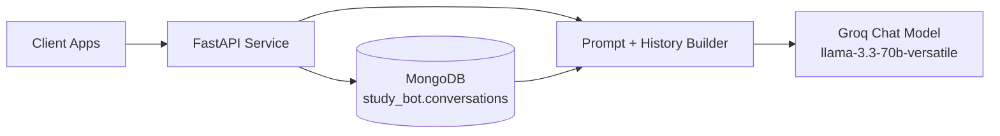
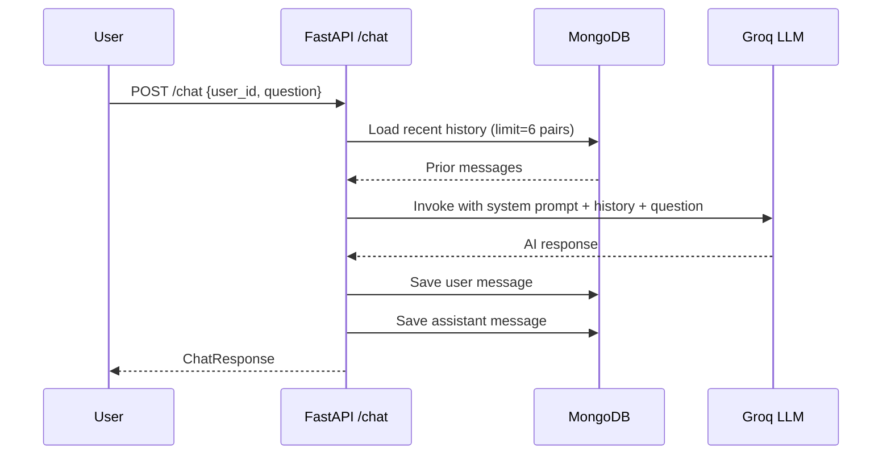

# Study Chat Bot API

A production-style FastAPI backend for an academic-only chatbot powered by **Groq LLM (Llama 3.3 70B Versatile)**, **LangChain**, and **MongoDB**.

The service stores per-user conversation history, enforces a study-focused assistant behavior, and exposes REST APIs for chat, history management, and usage stats.

---

## Table of Contents

- [Features](#features)
- [Tech Stack](#tech-stack)
- [Architecture](#architecture)
- [Request Flow](#request-flow)
- [Project Structure](#project-structure)
- [API Endpoints](#api-endpoints)
- [Environment Variables](#environment-variables)
- [Getting Started](#getting-started)
- [Run the Server](#run-the-server)
- [API Usage Examples](#api-usage-examples)
- [Error Handling](#error-handling)
- [Security Notes](#security-notes)
- [Troubleshooting](#troubleshooting)
- [Deployment Notes](#deployment-notes)
- [Roadmap](#roadmap)
- [License](#license)

---

## Features

- Academic-only AI assistant behavior (non-study questions are rejected by prompt design)
- Conversation persistence in MongoDB
- Per-user chat history retrieval
- History cleanup endpoint
- User-level message statistics
- Swagger/OpenAPI docs out of the box (`/docs`)
- Automatic fallback to next available local port if preferred port is busy

---

## Tech Stack

- **Backend:** FastAPI
- **LLM Orchestration:** LangChain
- **LLM Provider:** Groq (`llama-3.3-70b-versatile`)
- **Database:** MongoDB (`pymongo`)
- **Config Management:** `python-dotenv`
- **Server:** Uvicorn

---

## Architecture



---

## Request Flow



---

## Project Structure

```text
.
├── app.py
├── requirements.txt
└── README.md
```

---

## API Endpoints

### 1) Health / Service Info
- **GET** `/`
- Returns service metadata and available endpoints.

### 2) Chat
- **POST** `/chat`
- Request body:
  ```json
  {
    "user_id": "student_001",
    "question": "Explain Newton's second law"
  }
  ```
- Response body:
  ```json
  {
    "response": "...",
    "user_id": "student_001",
    "timestamp": "2026-02-21T10:00:00.000000"
  }
  ```

### 3) Get User History
- **GET** `/history/{user_id}`
- Returns all stored messages for the user (latest first).

### 4) Clear User History
- **DELETE** `/history/{user_id}`
- Deletes all stored messages for the user.

### 5) User Stats
- **GET** `/stats/{user_id}`
- Returns totals for user and assistant messages.

---

## Environment Variables

Create a `.env` file in the project root:

```env
GROQ_API_KEY=your_groq_api_key
MONGO_URL=your_mongodb_connection_uri
HOST=127.0.0.1
PORT=8000
```

### Required
- `GROQ_API_KEY`
- `MONGO_URL`

### Optional
- `HOST` (default: `127.0.0.1`)
- `PORT` (default: `8000`)

---

## Getting Started

### Prerequisites

- Python 3.10+
- MongoDB instance (local or cloud)
- Groq API key

### Installation

```bash
# 1) Clone repository
git clone https://github.com/skr2rathishan-oss/Study_Chat_Bot.git
cd Study_Chat_Bot

# 2) Create virtual environment
python -m venv venv

# 3) Activate virtual environment
# Windows PowerShell
.\venv\Scripts\Activate.ps1

# macOS/Linux
source venv/bin/activate

# 4) Install dependencies
pip install -r requirements.txt
```

---

## Run the Server

```bash
python app.py
```

When running, it prints:
- API base URL (local)
- Swagger docs URL at `/docs`

If `PORT` is occupied, the app automatically uses the next available port.

---

## API Usage Examples

### Chat Request

```bash
curl -X POST "http://127.0.0.1:8000/chat" \
  -H "Content-Type: application/json" \
  -d "{\"user_id\":\"student_001\",\"question\":\"What is photosynthesis?\"}"
```

### Get History

```bash
curl "http://127.0.0.1:8000/history/student_001"
```

### Get Stats

```bash
curl "http://127.0.0.1:8000/stats/student_001"
```

### Clear History

```bash
curl -X DELETE "http://127.0.0.1:8000/history/student_001"
```

---

## Error Handling

The API returns standard HTTP error responses via `HTTPException`.

Examples:
- `500 Internal Server Error` for chat processing/database failures
- Startup `ValueError` if required environment variables are missing

---

## Security Notes

Current behavior is suitable for development and prototype use:

- CORS is fully open (`allow_origins=["*"]`)
- No authentication or authorization is implemented
- User identity is caller-provided (`user_id`)

For production, strongly consider:
- Restricting CORS to trusted origins
- Adding API authentication (JWT/OAuth2/API keys)
- Rate limiting and abuse protection
- Input validation hardening and audit logging

---

## Troubleshooting

### `GROQ_API_KEY not found in environment variables`
- Ensure `.env` exists in project root.
- Verify the key name is exactly `GROQ_API_KEY`.

### `MONGO_URL not found in environment variables`
- Add valid MongoDB URI in `.env`.
- Confirm network access to the MongoDB host.

### Connection issues to MongoDB
- Verify IP allowlist/firewall settings (for cloud MongoDB).
- Check credentials and database permissions.

### Port already in use
- App auto-selects next free port.
- Use the printed URL in terminal output.

---

## Deployment Notes

- Replace open CORS policy with restricted origins.
- Run behind a process manager (systemd, supervisor, Docker, or cloud runtime).
- Configure secrets using environment variables from your hosting platform.
- Add structured logging and health monitoring for reliability.

---

## Roadmap

- Authentication & authorization
- Rate limiting
- Better observability (logs/metrics/tracing)
- Unit and integration tests
- Containerization (`Dockerfile` + `docker-compose`)

---

## License

No license file is currently included.
If you plan to open-source this project, add a license (for example, MIT) in a `LICENSE` file.
